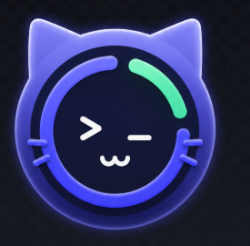
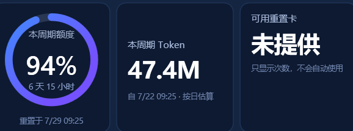

# 🐾 Codex Quota Pet / Codex 额度喵

<div align="center">
  
  <p><strong>给你的 Codex 额度配一只猫。现在，核心竞争力真的会喵。</strong></p>
  <p><strong>Your Codex quota has a cat now. Yes, it meows.</strong></p>
  <p>中文 · <a href="#english">English</a></p>
</div>

---

## 中文

Codex 额度喵是一个轻量、原生的 Windows 悬浮助手。它安静地趴在桌面边缘，替你看守 Codex 剩余额度、重置倒计时和本机 Token 使用情况。

它不修改 Codex、不读取登录令牌，也不会偷偷吃掉你的额度。它只负责可爱，以及在你快用完时认真看着你。

### UI 图片示意 / UI Preview

#### 简洁悬浮球 / Compact floating widget

只有约 84×84，适合安静地趴在屏幕边缘。百分比和重置倒计时是两条最重要的信息。

<p align="center">
  
</p>

#### 详细面板 / Detailed dashboard

双击猫猫即可展开：本周期额度、本周期 Token、今日 Token、请求数、重置卡和趋势都在这里。



> 上面两张都是程序的实际 Windows 界面，不是概念图。猫猫本人则负责住在任务栏和托盘里。

- **简洁模式**：默认只有约 84×84，显示剩余百分比和醒目的重置倒计时。
- **详细模式**：查看本周期额度、本周期 Token、今日 Token、请求数、重置卡和最近 7 天趋势。
- 双击悬浮球进入详细模式；双击详细页空白区域即可缩回。
- 猫猫同时住在应用窗口、任务栏和系统托盘里。

### 为什么会喜欢它

- 🐱 **真的有猫**：这不是装饰，是产品战略。
- 🪶 **非常轻**：没有 Electron、没有安装器、没有第三方运行库。
- 🔄 **及时刷新**：本机 Token 统计优先读取最新会话增量；额度读取失败时会使用更新的本地快照。
- 📅 **日期靠谱**：趋势固定展示今天及之前 6 天，缺失日期补 0。
- 🔒 **对登录信息保持距离**：不读取 `auth.json`、浏览器 Cookie、OAuth token 或 API key。
- 🧼 **不碰会话正文**：日志扫描只提取事件时间、Token 数值和额度字段。

### 直接使用

1. 下载 [`CodexQuotaPet-v1.0.0-win-x64.zip`](release/CodexQuotaPet-v1.0.0-win-x64.zip)。
2. 解压到任意文件夹。
3. 双击 `Start-CodexQuotaPet.cmd`。
4. 不想养了——只是暂时——双击 `Stop-CodexQuotaPet.cmd`。

Windows 10/11 自带所需的 .NET Framework 4.8 运行环境。首次启动会在需要时使用 Windows 系统 C# 编译器生成 EXE。

### 从源码构建

```bat
Build.cmd
Test.cmd
```

构建产物位于 `bin\`：

- `CodexQuotaPet.exe`：无控制台悬浮助手。
- `CodexQuotaPet.Cli.exe --once`：输出一次安全、精简的诊断结果。

### 数据从哪里来

额度通过本机短生命周期的 `codex app-server` 只读获取；Token 趋势来自本机 `CODEX_HOME/sessions` 中的累计 Token 增量。

当服务端没有返回某个字段时，界面会诚实地显示“未提供”。例如重置卡没有读取到时，不会猜测，也不会沿用旧数字。

> 本地 Token 统计只代表这台电脑上可见的 Codex 会话，可能与跨设备账户汇总不同。

### 小提示

- 拖动悬浮球可以移动位置，靠近屏幕边缘会自动吸附。
- 从窗口边缘拖动可以调整大小。
- `Ctrl+Alt+Q` 可以随时显示或隐藏。
- 关闭按钮默认隐藏到托盘；托盘菜单里可以彻底退出。
- `Check-CodexQuotaPet.cmd` 会进行一次只读环境检查。

---

<a id="english"></a>

## English

Codex Quota Pet is a tiny native Windows companion that sits near the edge of your desktop and watches your Codex quota, reset countdown, and local Token usage.

It does not modify Codex, read your credentials, or spend anything on your behalf. Its two jobs are being useful and being a cat.

### Meet the quota cat

The screenshots above show the real compact widget and detailed Windows dashboard—not a mock-up.

- **Compact mode**: an approximately 84×84 floating ball with the remaining percentage and a prominent reset countdown.
- **Detailed mode**: cycle quota, cycle Tokens, today's Tokens, requests, reset credits, and a normalized seven-day chart.
- Double-click the ball to expand; double-click a non-interactive area in the dashboard to shrink.
- The cat also appears in the window, Windows taskbar, and system tray.

### Why it is nice

- 🐱 **Cat-powered differentiation** — an entirely serious product decision.
- 🪶 **Lightweight** — no Electron, installer, or third-party runtime.
- 🔄 **Fresh local stats** — local session deltas are preferred for responsive Token updates.
- 📅 **Correct calendar buckets** — today plus the previous six days, with missing dates filled as zero.
- 🔒 **Credential-friendly** — never reads `auth.json`, browser cookies, OAuth tokens, or API keys.
- 🧼 **Conversation-safe** — only timestamps, Token counters, and quota fields are extracted from local logs.

### Quick start

1. Download [`CodexQuotaPet-v1.0.0-win-x64.zip`](release/CodexQuotaPet-v1.0.0-win-x64.zip).
2. Extract it anywhere.
3. Double-click `Start-CodexQuotaPet.cmd`.
4. Use `Stop-CodexQuotaPet.cmd` for a clean exit.

Windows 10/11 already includes the required .NET Framework 4.8 runtime. If the EXE is missing, the launcher can build it with the Windows system C# compiler.

### Build from source

```bat
Build.cmd
Test.cmd
```

The build creates:

- `bin\CodexQuotaPet.exe` — the floating GUI.
- `bin\CodexQuotaPet.Cli.exe --once` — a safe one-shot diagnostic command.

### Data and privacy

Quota data is read from a short-lived local `codex app-server` process. Token history is calculated from cumulative counters in local `CODEX_HOME/sessions` files.

If a field is unavailable, the UI says so. Missing reset-credit data is displayed as “Not provided”; the app never guesses or reuses a stale number.

> Local Token totals represent sessions visible on this computer and can differ from cross-device account totals.

---

<div align="center">
  <strong>Made for Codex users, supervised by one very small cat. 🐾</strong>
</div>
